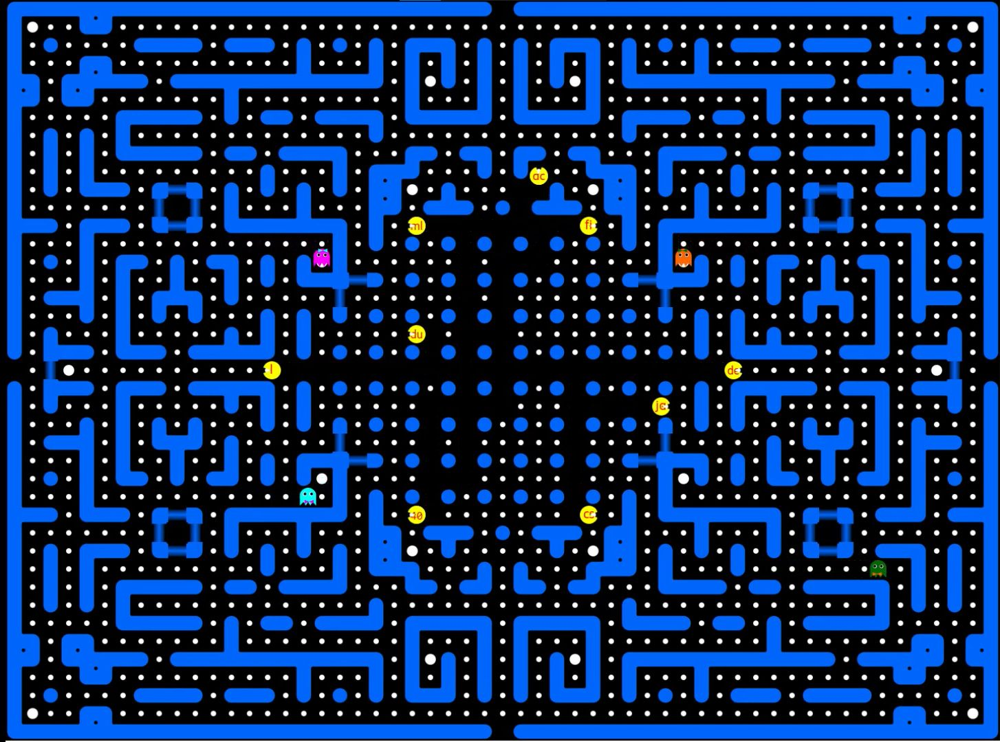
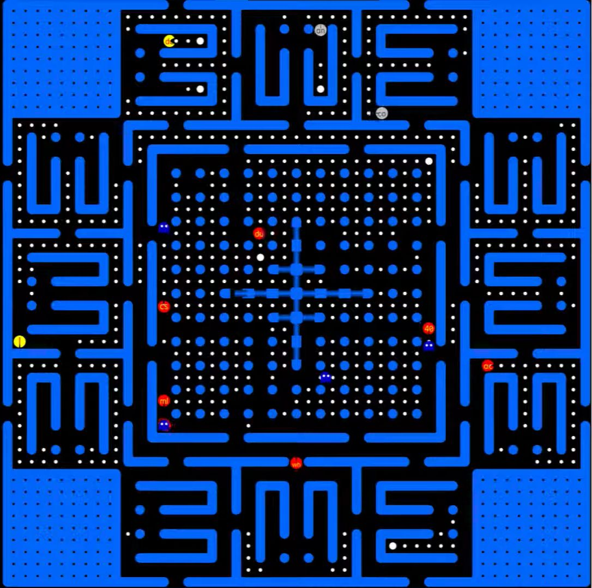
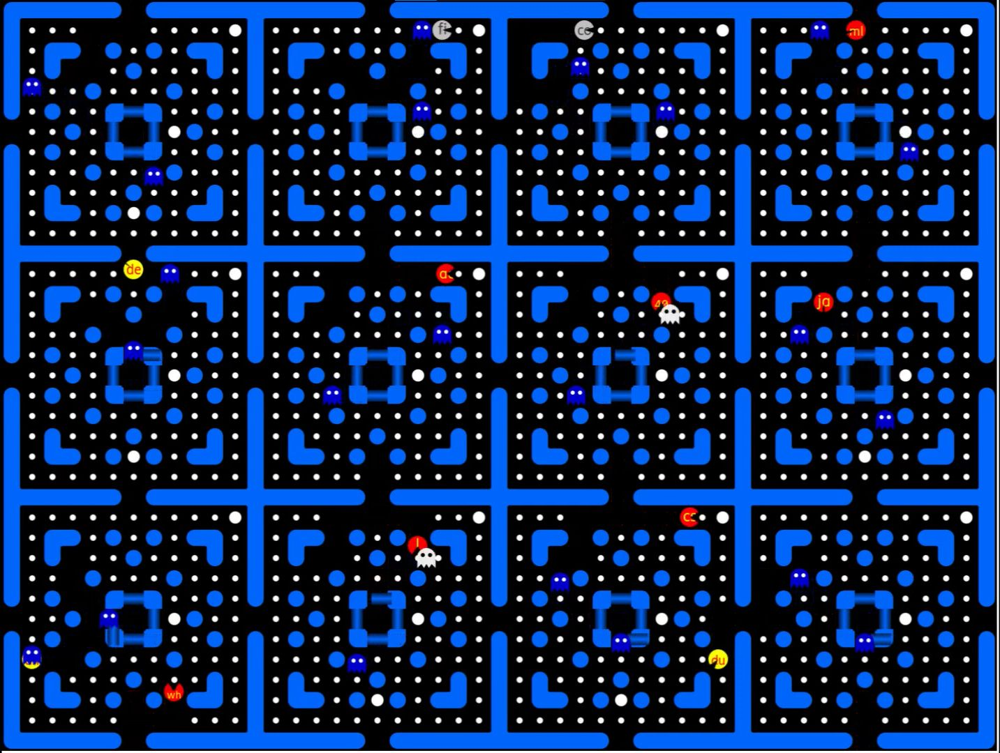

# Ericsson-PacMan

In the Ericsson Programming Championship, the task was create a program that can play an advanced multiplayer version of Pac-Man automatically.
Our approacs was a minimax-like algorithm with a small search depth, but a complex heuristic function.
We considered all other Pac-s, ghosts, and the distance of each and every collectable point.

In the first few rounds, our algorithm competed with pre-coded enemies controlled by simple algorithms.
However, in the final, all 12 finalists were put together in 3 huge arenas to hunt for points against each other.
The greatest difficulty was caused by the fact that when two players collided, there was a point-flow between them, so we had to avoid weaker players, but could collect extra points by pursuing stronger ones.

The three arenas mentioned above looked like this:

